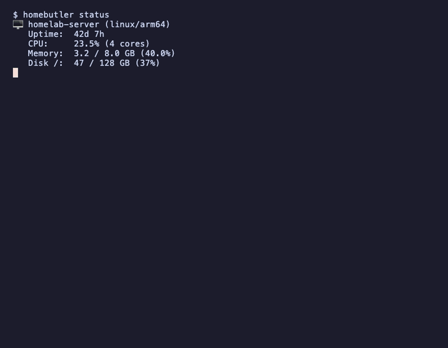

[](https://go.dev)
[](LICENSE)
[](https://github.com/Higangssh/homebutler/releases)

# homebutler 🏠

**Manage your homelab from Telegram. One binary. Zero dependencies.**

A single-binary CLI that lets you monitor servers, control Docker, wake machines, and scan your network — directly from chat. Built for AI assistants, works great standalone.

## Features

- **System Status** — CPU, memory, disk, uptime at a glance
- **Docker Management** — List, restart, stop, logs for containers
- **Wake-on-LAN** — Power on machines remotely
- **Port Scanner** — See what's listening and which process owns it
- **Network Scan** — Discover devices on your LAN
- **Alerts** — Get notified when resources exceed thresholds
- **Multi-server** *(planned)* — Manage remote servers over SSH
- **JSON Output** — Pipe-friendly, perfect for AI assistants to parse

## Why homebutler?

> Other tools give you dashboards. homebutler gives you a **conversation**.

<details>
<summary>📊 Comparison with alternatives</summary>

| | homebutler | Glances/btop | Netdata | CasaOS |
|---|---|---|---|---|
| Single binary | ✅ | ❌ | ❌ | ❌ |
| No web server | ✅ | ❌ | ❌ | ❌ |
| Chat integration | ✅ Native | ❌ | ❌ | ❌ |
| AI-friendly JSON | ✅ | ❌ | ⚠️ API | ⚠️ API |
| Docker control | ✅ | ❌ | ❌ | ✅ |
| Wake-on-LAN | ✅ | ❌ | ❌ | ❌ |
| Network scan | ✅ | ❌ | ❌ | ❌ |
| Air-gapped install | ✅ Copy binary | ❌ pip/npm | ❌ Docker | ❌ Docker |
| Resource usage | ~3MB, 0% idle | Medium | High | High |

</details>

## Demo

<p>
  
  
</p>

## Quick Start

```bash
# Install
go install github.com/Higangssh/homebutler@latest

# Or download from releases
curl -fsSL https://github.com/Higangssh/homebutler/releases/latest/download/homebutler-$(uname -s)-$(uname -m) -o homebutler
chmod +x homebutler

# Run
homebutler status
homebutler docker list
homebutler wake desktop
homebutler ports
```

## Usage

```
homebutler <command> [flags]

Commands:
  status              System status (CPU, memory, disk, uptime)
  docker list         List running containers
  docker restart <n>  Restart a container
  docker stop <n>     Stop a container
  docker logs <n>     Show container logs
  wake <name>         Send Wake-on-LAN packet
  ports               List open ports with process info
  network scan        Discover devices on LAN
  alerts              Show current alert status
  version             Print version

Flags:
  --config <path>     Config file (auto-detected, see Configuration)
  --json              Force JSON output
  --server <name>     Target server (planned, default: local)
```

## Configuration

homebutler searches for a config file in the following order:

1. `--config <path>` — Explicit flag (highest priority)
2. `$HOMEBUTLER_CONFIG` — Environment variable
3. `~/.config/homebutler/config.yaml` — XDG standard location
4. `./homebutler.yaml` — Current directory

If no config file is found, sensible defaults are used (CPU 90%, memory 85%, disk 90%).

```bash
# Recommended: use XDG location
mkdir -p ~/.config/homebutler
cp homebutler.example.yaml ~/.config/homebutler/config.yaml

# Or use environment variable
export HOMEBUTLER_CONFIG=/path/to/config.yaml

# Or just put it in the current directory
cp homebutler.example.yaml homebutler.yaml
```

See [homebutler.example.yaml](homebutler.example.yaml) for all options.

## Security

- **No network listener** — homebutler never opens ports or accepts connections
- **Read-only by default** — Status commands don't modify anything
- **Explicit actions only** — Destructive commands require exact container/service names
- **SSH for remote** *(planned)* — Multi-server will use standard SSH (key-based auth recommended)
- **No telemetry** — Zero data collection, zero phone-home

## Use with AI Assistants

homebutler outputs JSON, making it perfect for AI assistants:

```bash
# AI assistant runs this, parses JSON, responds in user's language
homebutler status --json
```

### OpenClaw Skill

An official [OpenClaw](https://github.com/openclaw/openclaw) skill is available on [ClawHub](https://clawhub.ai/skills/homeserver):

```bash
clawhub install homeserver
```

This lets you manage your homelab from Telegram, Discord, or any chat platform connected to OpenClaw — in any language.

## Installation

### Binary Download

Download the latest binary for your platform from [Releases](https://github.com/Higangssh/homebutler/releases):

```bash
# Linux (amd64)
curl -fsSL https://github.com/Higangssh/homebutler/releases/latest/download/homebutler_linux_amd64.tar.gz | tar xz

# Linux (arm64 — Raspberry Pi, etc.)
curl -fsSL https://github.com/Higangssh/homebutler/releases/latest/download/homebutler_linux_arm64.tar.gz | tar xz

# macOS (Apple Silicon)
curl -fsSL https://github.com/Higangssh/homebutler/releases/latest/download/homebutler_darwin_arm64.tar.gz | tar xz

# macOS (Intel)
curl -fsSL https://github.com/Higangssh/homebutler/releases/latest/download/homebutler_darwin_amd64.tar.gz | tar xz

sudo mv homebutler /usr/local/bin/
```

### Go Install

```bash
go install github.com/Higangssh/homebutler@latest
```

### Build from Source

```bash
git clone https://github.com/Higangssh/homebutler.git
cd homebutler
make build
```

## Contributing

Contributions welcome! Please open an issue first to discuss what you'd like to change.

## License

[MIT](LICENSE)
