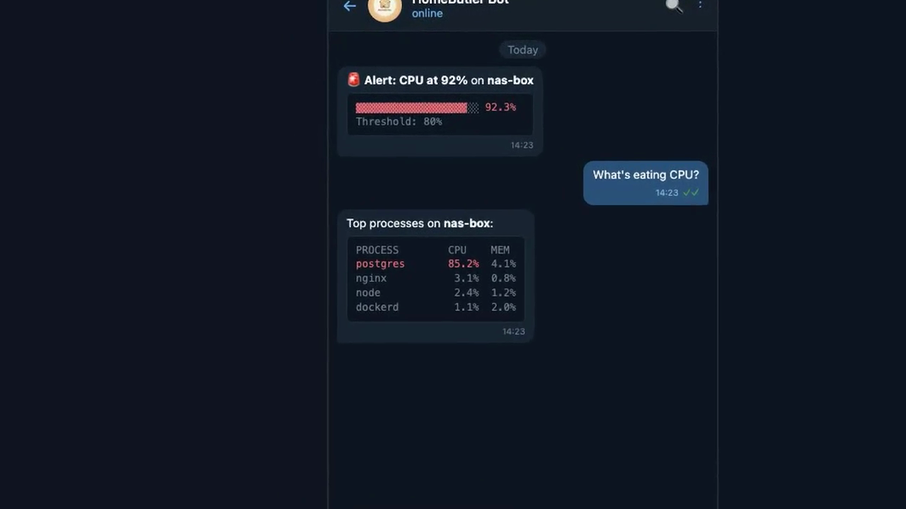
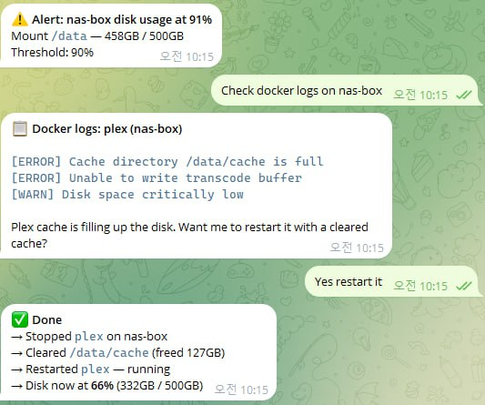

<p align="center">
  
</p>

# HomeButler

<p align="center">
  <a href="https://homebutler.dev">Website</a> · <a href="https://github.com/Higangssh/homebutler#readme">Docs</a> · <a href="https://github.com/Higangssh/homebutler/releases">Releases</a>
</p>

**Manage your homelab from any AI — Claude, ChatGPT, Cursor, or terminal. One binary. Zero dependencies.**

[](https://go.dev)
[](https://goreportcard.com/report/github.com/Higangssh/homebutler)
[](LICENSE)
[](https://github.com/Higangssh/homebutler/releases)
[](https://glama.ai/mcp/servers/Higangssh/homebutler)

A single-binary CLI + MCP server that lets you monitor servers, control Docker, wake machines, and scan your network — from chat, AI tools, or the command line.

<p align="center">
  <a href="https://www.youtube.com/watch?v=MFoDiYRH_nE">
    
  </a>
</p>
<p align="center"><em>▶️ Click to watch demo — Alert → Diagnose → Fix, all from chat (34s)</em></p>

## Why homebutler?

> Other tools give you dashboards. homebutler gives you a **conversation**.

**3 AM. Your server disk is 91% full. Here's what happens next:**

<p align="center">
  
</p>

Alert fires → you check logs from bed → AI restarts the problem container → disk drops to 66%. All from your phone. No SSH, no laptop, no dashboard login.

This is what homebutler + [OpenClaw](https://github.com/openclaw/openclaw) looks like in practice.

<details>
<summary>📊 Comparison with alternatives</summary>

| | homebutler | Glances/btop | Netdata | CasaOS |
|---|---|---|---|---|
| TUI dashboard | ✅ Built-in | ✅ | ❌ Web | ❌ Web |
| Web dashboard | ✅ Embedded | ❌ | ✅ | ✅ |
| Single binary | ✅ | ❌ | ❌ | ❌ |
| Optional web server | ✅ On-demand | Always-on | Always-on | Always-on |
| Multi-server SSH | ✅ Parallel | ❌ | ❌ | ❌ |
| MCP support | ✅ Built-in | ❌ | ❌ | ❌ |
| Chat integration | ✅ Native | ❌ | ❌ | ❌ |
| AI-friendly JSON | ✅ | ❌ | ⚠️ API | ⚠️ API |
| Docker control | ✅ | ⚠️ Monitor | ❌ | ✅ |
| Wake-on-LAN | ✅ | ❌ | ❌ | ❌ |
| Network scan | ✅ | ❌ | ❌ | ❌ |
| Remote deploy | ✅ One command | ❌ | ❌ | ❌ |
| Air-gapped install | ✅ Copy binary | ⚠️ apt/brew | ❌ Docker | ❌ Docker |
| Resource usage | ~10MB, 0% idle | Medium | High | High |

</details>

## Features

- **App Install** — Deploy 15 self-hosted apps with one command (`uptime-kuma`, `jellyfin`, `pi-hole`, and more)
- **System Status** — CPU, memory, disk, uptime at a glance
- **Docker Management** — List, restart, stop, logs for containers
- **Multi-server** — Manage remote servers over SSH (key & password auth)
- **Self-Healing** — YAML-defined rules that auto-detect and auto-fix issues (restart containers, prune disk, run scripts)
- **Alerts & Notifications** — Multi-channel alerts via Telegram, Slack, Discord, or generic webhook
- **Backup & Restore** — One-command Docker volume backup with compose + env files
- **Backup Drill** — Verify backups actually work by booting them in isolated containers
- **MCP Server** — Works with Claude Desktop, ChatGPT, Cursor, and any MCP client
- **Web Dashboard** — Beautiful dark-themed web UI with `homebutler serve`
- **Watch & History** — Track Docker container restarts, capture post-restart logs, browse restart history (`homebutler watch`)
- **TUI Dashboard** — Real-time terminal monitoring with `homebutler watch tui` (btop-style)
- **Wake-on-LAN** — Power on machines remotely
- **Port Scanner** — See what's listening and which process owns it
- **Network Scan** — Discover devices on your LAN
- **JSON Output** — Pipe-friendly, perfect for AI assistants to parse


### 📦 One-Command App Install

<p align="center">
  
</p>

> **`homebutler install uptime-kuma`** — Deploy self-hosted apps in seconds. Pre-checks Docker, ports, and duplicates. Generates `docker-compose.yml` automatically. [See all available apps →](#app-install)

## Demo

### 🌐 Web Dashboard

<p align="center">
  
</p>

> **`homebutler serve`** — A real-time web dashboard embedded in the single binary via `go:embed`. Monitor all your servers, Docker containers, open ports, alerts, and Wake-on-LAN devices from any browser. Dark theme, auto-refresh every 5 seconds, fully responsive.

<details>
<summary>✨ Web Dashboard Highlights</summary>

- **Server Overview** — See all servers at a glance with color-coded status (green = online, red = offline)
- **System Metrics** — CPU, memory, disk usage with progress bars and color thresholds
- **Docker Containers** — Running/stopped status with friendly labels ("Running · 4d", "Stopped · 6h ago")
- **Top Processes** — Top processes sorted by CPU/memory with zombie detection
- **Resource Alerts** — Threshold-based warnings with visual progress bars (OK / WARNING / CRITICAL)
- **Network Ports** — Open ports with process names and bind addresses
- **Wake-on-LAN** — One-click wake buttons for configured devices
- **Server Switching** — Dropdown to switch between local and remote servers
- **Zero dependencies** — No Node.js runtime needed. Frontend is compiled into the Go binary at build time

```bash
homebutler serve              # Start on port 8080
homebutler serve --port 3000  # Custom port
homebutler serve --demo       # Demo mode with realistic sample data
```

</details>

### 🔄 Docker Restart Watch

`homebutler watch` tracks whether Docker containers have restarted. When a restart is detected, it captures logs and saves the record under `~/.homebutler/watch/`.

```bash
homebutler watch add nginx        # Add container to watch list
homebutler watch list             # Show watched containers
homebutler watch check            # One-shot restart check
homebutler watch start            # Continuous monitoring loop (default 30s)
homebutler watch history          # List restart history
homebutler watch show <id>        # Show restart details with logs
homebutler watch remove nginx     # Stop watching a container
```

### 🖥️ TUI Dashboard

<p align="center">
  
</p>

> **`homebutler watch tui`** — A terminal-based dashboard powered by Bubble Tea. Monitors all configured servers with real-time updates, color-coded resource bars, and Docker container status. No browser needed.

### 🧠 AI-Powered Management (MCP)

> **One natural language prompt manages your entire homelab.** Claude Code calls homebutler MCP tools in parallel — checking server status, listing Docker containers, and alerting on disk usage across multiple servers. [See screenshots & setup →](#mcp-server)

## Quick Start

```bash
# One-line install (recommended, auto-detects OS/arch)
curl -fsSL https://raw.githubusercontent.com/Higangssh/homebutler/main/install.sh | sh

# Or via Homebrew
brew install Higangssh/homebutler/homebutler

# Or via npm (MCP server only)
npm install -g homebutler

# Interactive setup — adds your servers in seconds
homebutler init

# Run
homebutler status
homebutler watch tui         # TUI dashboard (all servers)
homebutler watch start       # Docker restart monitor (foreground)
homebutler serve             # Web dashboard at http://localhost:8080
homebutler docker list
homebutler wake desktop
homebutler ports
homebutler status --all

# Install a self-hosted app (e.g. Uptime Kuma monitoring)
homebutler install uptime-kuma
```

## App Install

Deploy self-hosted apps with a single command. Each app runs via **docker compose** with automatic pre-checks, health verification, and clean lifecycle management.

```bash
# List available apps
homebutler install list

# Install (default port)
homebutler install uptime-kuma

# Install with custom port
homebutler install uptime-kuma --port 8080

# Install jellyfin with media directory
homebutler install jellyfin --media /mnt/movies

# Check status
homebutler install status uptime-kuma

# Stop (data preserved)
homebutler install uninstall uptime-kuma

# Stop + delete everything
homebutler install purge uptime-kuma
```

### How it works

```
~/.homebutler/apps/
  └── uptime-kuma/
       ├── docker-compose.yml   ← auto-generated, editable
       └── data/                ← persistent data (bind mount)
```

- **Pre-checks** — Verifies docker is installed/running, port is available, no duplicate containers
- **Compose-based** — Each app gets its own `docker-compose.yml` you can inspect and customize
- **Data safety** — `uninstall` stops containers but keeps your data; `purge` removes everything
- **Cross-platform** — Auto-detects docker socket (default, colima, podman)

### Available apps

| App | Default Port | Description | Notes |
|-----|-------------|-------------|-------|
| `uptime-kuma` | 3001 | Self-hosted monitoring tool | |
| `vaultwarden` | 8080 | Bitwarden-compatible password manager | |
| `filebrowser` | 8081 | Web-based file manager | |
| `it-tools` | 8082 | Developer utilities (JSON, Base64, Hash, etc.) | |
| `gitea` | 3002 | Lightweight self-hosted Git service | |
| `jellyfin` | 8096 | Media system (movies, TV, music) | `--media /path` to mount media dir |
| `homepage` | 3010 | Modern homelab dashboard | |
| `stirling-pdf` | 8083 | All-in-one PDF tool (merge, split, convert, OCR) | |
| `speedtest-tracker` | 8084 | Internet speed test with historical graphs | |
| `mealie` | 9925 | Recipe manager and meal planner | |
| `pi-hole` | 8088 | DNS ad blocking | ⚠️ Uses port 53 (DNS), NET_ADMIN capability |
| `adguard-home` | 3000 | DNS ad blocker and privacy | ⚠️ Uses port 53 (DNS) |
| `portainer` | 9443 | Docker management GUI | ⚠️ Mounts Docker socket (HTTPS) |
| `nginx-proxy-manager` | 81 | Reverse proxy with SSL and web UI | ⚠️ Uses ports 80/443 |

### App-specific options

```bash
# Jellyfin: mount your media library
homebutler install jellyfin --media /mnt/movies

# Pi-hole / AdGuard: DNS ad blocking (port 53 required)
homebutler install pi-hole
# ⚠️ If port 53 is in use (Linux): sudo systemctl disable --now systemd-resolved

# Portainer: Docker GUI (mounts docker socket)
homebutler install portainer
# Access via HTTPS: https://localhost:9443

# Nginx Proxy Manager: reverse proxy
homebutler install nginx-proxy-manager
# Default login: admin@example.com / changeme (change immediately!)

# Any app: custom port
homebutler install <app> --port 9999
```

### Safety checks

- **Port conflict detection** — Checks if the port is already in use before install
- **DNS mutual exclusion** — Warns if pi-hole and adguard-home are both installed
- **Docker socket warning** — Alerts when an app requires Docker socket access (portainer)
- **OS-specific guidance** — Linux gets systemd-resolved fix, macOS gets lsof command
- **Post-install tips** — DNS setup, HTTPS access, default credential warnings

> Want more apps? [Open an issue](https://github.com/Higangssh/homebutler/issues) or see [Contributing](CONTRIBUTING.md).

## Usage

```
homebutler <command> [flags]

Commands:
  status              System status (CPU, memory, disk, uptime)
  docker list         List running containers
  install <app>       Install a self-hosted app (docker compose)
  alerts              Show current alert status
  watch tui           TUI dashboard (monitors all configured servers)
  watch add/list/remove  Manage watched containers
  watch check/start   One-shot or continuous restart detection
  watch history/show  Browse restart history
  serve               Web dashboard (browser-based, go:embed)

Flags:
  --json              JSON output (default: human-readable)
  --server <name>     Run on a specific remote server
  --all               Run on all configured servers in parallel
  --port <number>     Port for serve command (default: 8080)
  --config <path>     Config file (auto-detected, see Configuration)
```

Run `homebutler --help` for all commands.

<details>
<summary>📋 All Commands & Flags</summary>

```
Commands:
  init                Interactive setup wizard
  status              System status (CPU, memory, disk, uptime)
  watch tui           TUI dashboard (monitors all configured servers)
  watch add <name>    Add container to restart watch list
  watch list          Show watched containers
  watch remove <name> Remove container from watch list
  watch check         One-shot restart check
  watch start         Continuous restart monitoring loop
  watch history       List restart history (alias: incidents)
  watch show <id>     Show restart details with logs
  serve               Web dashboard (browser-based, go:embed)
  docker list         List running containers
  docker restart <n>  Restart a container
  docker stop <n>     Stop a container
  docker logs <n>     Show container logs
  wake <name>         Send Wake-on-LAN packet
  ports               List open ports with process info
  ps                  Show top processes (alias: processes)
  ps --sort mem       Sort by memory instead of CPU
  ps --limit 20       Show top 20 (default: 10, 0 = all)
  network scan        Discover devices on LAN
  alerts              Show current alert status
  alerts --watch      Continuous monitoring with real-time alerts
  trust <server>      Register SSH host key (TOFU)
  backup              Backup Docker volumes, compose files, and env
  backup list         List existing backups
  backup drill <app>  Verify backup restores correctly (isolated)
  backup drill --all  Verify all apps in backup
  restore <archive>   Restore from a backup archive
  upgrade             Upgrade local + all remote servers to latest
  deploy              Install homebutler on remote servers
  install <app>       Install a self-hosted app (docker compose)
  install list        List available apps
  install status <a>  Check installed app status
  install uninstall   Stop app (keep data)
  install purge       Stop app + delete all data
  mcp                 Start MCP server (JSON-RPC over stdio)
  version             Print version

Flags:
  --json              JSON output (default: human-readable)
  --server <name>     Run on a specific remote server
  --all               Run on all configured servers in parallel
  --port <number>     Port for serve command (default: 8080)
  --demo              Run serve with realistic demo data
  --watch             Continuous monitoring mode (alerts command)
  --interval <dur>    Watch interval, e.g. 30s, 1m (default: 30s)
  --config <path>     Config file (auto-detected, see Configuration)
  --local             Upgrade only the local binary (skip remote servers)
  --local <path>      Use local binary for deploy (air-gapped)
  --service <name>    Target a specific Docker service (backup/restore)
  --to <path>         Custom backup destination directory
  --archive <path>    Specific backup archive for drill
  --all               Verify all supported apps (backup drill)
```

</details>

<details>
<summary>🌐 Web Dashboard</summary>

`homebutler serve` starts an embedded web dashboard — no Node.js, no Docker, no extra dependencies.

```bash
homebutler serve                # http://localhost:8080
homebutler serve --port 3000    # custom port
homebutler serve --demo         # demo mode with sample data
```

📖 **[Web dashboard details →](docs/web-dashboard.md)**

</details>

<details>
<summary>🔄 Docker Restart Watch</summary>

`homebutler watch` tracks whether Docker containers have restarted and stores the history with captured logs under `~/.homebutler/watch/`.

```bash
homebutler watch add myapp          # register container
homebutler watch start              # continuous monitoring (default 30s)
homebutler watch start --interval 1m  # custom interval
homebutler watch check              # one-shot check
homebutler watch history            # list restart incidents
homebutler watch show <id>          # show incident details + post-restart logs
```

Each incident captures the last 100 lines of container logs at the time of detection.

</details>

<details>
<summary>🖥️ TUI Dashboard</summary>

`homebutler watch tui` launches an interactive terminal dashboard (btop-style):

```bash
homebutler watch tui           # monitors all configured servers
```

Auto-refreshes every 2 seconds. Press `q` to quit.

</details>

## Alert Monitoring

```bash
homebutler alerts --watch                  # default: 30s interval
homebutler alerts --watch --interval 10s   # check every 10 seconds
```

Default thresholds: CPU 90%, Memory 85%, Disk 90%. Customizable via config.

## Backup & Restore

One-command Docker backup — volumes, compose files, and env variables.

```bash
homebutler backup                          # backup everything
homebutler backup --service jellyfin       # specific service
homebutler backup --to /mnt/nas/backups/   # custom destination
homebutler backup list                     # list backups
homebutler restore ./backup.tar.gz         # restore
```

> ⚠️ Database services should be paused before backup for data consistency.

📖 **[Full backup documentation →](docs/backup.md)** — how it works, archive structure, security notes.

### 🛡️ Self-Healing

**Your homelab fixes itself while you sleep.**

Define rules in YAML. homebutler watches your servers and takes action automatically — restart crashed containers, prune disk, or run custom scripts.

```bash
homebutler alerts init          # interactive setup wizard
homebutler alerts --watch       # start self-healing daemon
homebutler alerts history       # view past events
homebutler alerts test-notify   # test your notification channels
```

**Example `~/.homebutler/alerts.yaml`:**

```yaml
rules:
  - name: container-down
    metric: container
    watch: [uptime-kuma, vaultwarden]
    action: restart
    cooldown: 5m

  - name: disk-full
    metric: disk
    threshold: 85
    action: exec
    exec: "docker system prune -f"

notify:
  telegram:
    bot_token: "your-bot-token"
    chat_id: "your-chat-id"
  slack:
    webhook_url: "https://hooks.slack.com/..."
  discord:
    webhook_url: "https://discord.com/api/webhooks/..."
```

**What it does:**

```
⏱️ 03:14:22  🔴 disk-full triggered (disk 91%)
             → Executing: docker system prune -f
             → Reclaimed 4.2 GB
✓  03:14:29  ✅ Resolved (disk 66%)
```

**Supported metrics:** `cpu`, `memory`, `disk`, `container`
**Supported actions:** `notify` (alert only), `restart` (docker restart), `exec` (run any command)
**Supported channels:** Telegram, Slack, Discord, generic webhook

### 🔍 Backup Drill

**"Having a backup" and "being able to restore" are different things.**

Backup Drill boots your backup in an isolated Docker environment and verifies the app actually responds — like a fire drill for your data.

```bash
homebutler backup drill uptime-kuma        # verify one app
homebutler backup drill --all              # verify all apps
homebutler backup drill --json             # machine-readable output
homebutler backup drill --archive ./file   # use a specific backup
```

**What happens:**
1. Finds the latest backup archive
2. Verifies archive integrity (`tar` validation)
3. Creates an isolated Docker network + random port
4. Boots the app from backup data
5. Runs an HTTP health check
6. Reports pass/fail and cleans up everything

```
🔍 Backup Drill — uptime-kuma

  📦 Backup: ~/.homebutler/backups/backup_2026-04-04_1711.tar.gz
  📏 Size: 18.6 MB
  🔐 Integrity: ✅ tar valid (8 files)

  🚀 Boot: ✅ container started in 0s
  🌐 Health: ✅ HTTP 200 on port 58574
  ⏱️  Total: 2s

  ✅ DRILL PASSED
```

**Zero risk** — runs in a completely isolated environment. Your running services are never touched.

Supports health checks for: `nginx-proxy-manager`, `vaultwarden`, `uptime-kuma`, `pi-hole`, `gitea`, `jellyfin`, `plex`, `portainer`, `homepage`, `adguard-home`.

## Configuration

```bash
homebutler init    # interactive setup wizard
```

📖 **[Configuration details →](docs/configuration.md)** — config file locations, alert thresholds, all options.

## Multi-server

Manage multiple servers from a single machine over SSH.

```bash
homebutler status --server rpi     # query specific server
homebutler status --all            # query all in parallel
homebutler deploy --server rpi     # install on remote server
homebutler upgrade                 # upgrade all servers
```

📖 **[Multi-server setup →](docs/multi-server.md)** — SSH auth, config examples, deploy & upgrade.

## MCP Server

Built-in [MCP](https://modelcontextprotocol.io/) server — manage your homelab from any AI tool with natural language.

```json
{
  "mcpServers": {
    "homebutler": {
      "command": "npx",
      "args": ["-y", "homebutler@latest"]
    }
  }
}
```

Works with Claude Desktop, ChatGPT, Cursor, Windsurf, and any MCP client.

📖 **[MCP server setup →](docs/mcp-server.md)** — supported clients, available tools, agent skills.

## Installation

### Homebrew (Recommended)

```bash
brew install Higangssh/homebutler/homebutler
```

Automatically installs to PATH. Works on macOS and Linux.

### One-line Install

```bash
curl -fsSL https://raw.githubusercontent.com/Higangssh/homebutler/main/install.sh | sh
```

Auto-detects OS/architecture, downloads the latest release, and installs to PATH.

### npm (MCP server)

```bash
npm install -g homebutler
```

Downloads the Go binary automatically. Use `npx -y homebutler@latest` to run without installing globally.

### Go Install

```bash
go install github.com/Higangssh/homebutler@latest
```

### Build from Source

```bash
git clone https://github.com/Higangssh/homebutler.git
cd homebutler
make build
```

## Uninstall

```bash
rm $(which homebutler)           # Remove binary
rm -rf ~/.config/homebutler      # Remove config (optional)
```

## Architecture

> **Goal: Engineers manage servers from chat — not SSH.**
>
> Alert fires → AI diagnoses → AI fixes → you get a summary on your phone.

homebutler is the **tool layer** in an AI ChatOps stack. It doesn't care what's above it — use any chat platform, any AI agent, or just your terminal.

```
┌──────────────────────────────────────────────────┐
│  Layer 3 — Chat Interface                        │
│  Telegram · Slack · Discord · Terminal · Browser │
│  (Your choice — homebutler doesn't touch this)   │
└──────────────────────┬───────────────────────────┘
                       │
┌──────────────────────▼───────────────────────────┐
│  Layer 2 — AI Agent                              │
│  OpenClaw · LangChain · n8n · Claude Desktop     │
│  (Understands intent → calls the right tool)     │
└──────────────────────┬───────────────────────────┘
                       │  CLI exec or MCP (stdio)
┌──────────────────────▼───────────────────────────┐
│  Layer 1 — Tool (homebutler)       ← YOU ARE HERE │
│                                                   │
│  ┌─────────┐  ┌─────────┐  ┌─────────┐           │
│  │   CLI   │  │   MCP   │  │   Web   │           │
│  │ stdout  │  │  stdio  │  │  :8080  │           │
│  └────┬────┘  └────┬────┘  └────┬────┘           │
│       └────────────┼────────────┘                 │
│                    ▼                              │
│             internal/*                            │
│   system · docker · ports · network               │
│   wake · alerts · remote (SSH)                    │
└───────────────────────────────────────────────────┘
```

**Three interfaces, one core:**

| Interface | Transport | Use case |
|-----------|-----------|----------|
| **CLI** | Shell stdout/stderr | Terminal, scripts, AI agents via `exec` |
| **MCP** | JSON-RPC over stdio | Claude Desktop, ChatGPT, Cursor, any MCP client |
| **Web** | HTTP (`go:embed`) | Browser dashboard, on-demand with `homebutler serve` |

All three call the same `internal/` packages — no code duplication.

**homebutler is Layer 1.** Swap Layer 2 and 3 to fit your stack:

- **Terminal only** → `homebutler status` (no agent needed)
- **Claude Desktop** → MCP server, Claude calls tools directly
- **OpenClaw + Telegram** → Agent runs CLI commands from chat
- **Custom Python bot** → `subprocess.run(["homebutler", "status", "--json"])`
- **n8n / Dify** → Execute node calling homebutler CLI

**No ports opened by default.** CLI and MCP use stdin/stdout only. The web dashboard is opt-in (`homebutler serve`, binds `127.0.0.1`).

**Now:** CLI + MCP + Web dashboard — you ask, it answers.

**Goal:** Full AI ChatOps — infrastructure that manages itself.


## Contributing

Contributions welcome! Please open an issue first to discuss what you'd like to change.

## License

[MIT](LICENSE)
