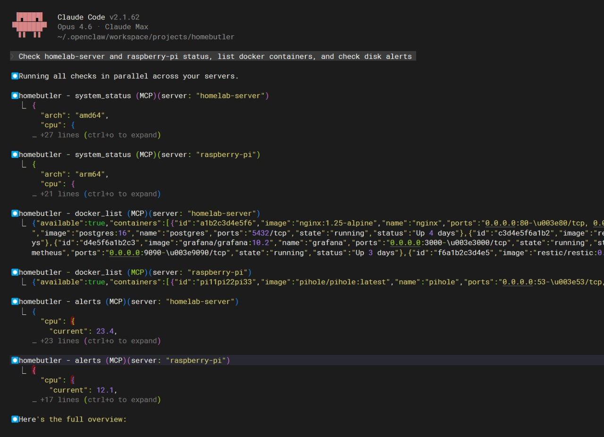
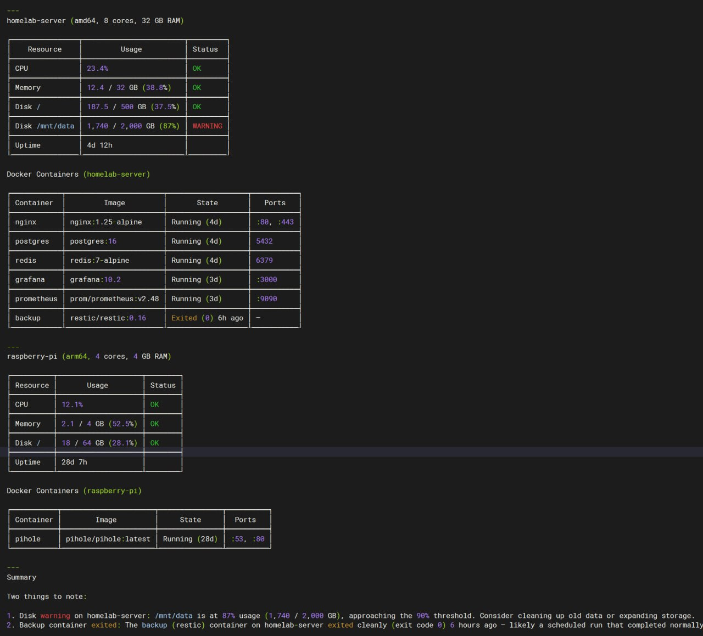

# MCP Server

homebutler includes a built-in [MCP (Model Context Protocol)](https://modelcontextprotocol.io/) server, so any AI tool can manage your homelab — with natural language.

> *"Check all my servers and list docker containers"*
>
> One prompt. Multiple servers. Full visibility.

<p align="center">
  
</p>

<p align="center">
  <em>Claude Code calls homebutler tools in parallel across servers</em>
</p>

<p align="center">
  
</p>

<p align="center">
  <em>Formatted results: server status, Docker containers, and disk alerts — from one prompt</em>
</p>

## Try Without Real Servers

```bash
# Demo mode — realistic data, no real system calls
homebutler mcp --demo
```

Add `"args": ["mcp", "--demo"]` to your MCP config to try it instantly.

## Supported Clients

- **Claude Code** — Anthropic's CLI for Claude
- **Claude Desktop** — Anthropic's desktop app
- **ChatGPT Desktop** — OpenAI's desktop app
- **Cursor** — AI code editor
- **Windsurf** — AI code editor
- **Any MCP-compatible client**

## Setup

Add to your MCP client config:

**Quick setup (no install needed):**
```json
{
  "mcpServers": {
    "homebutler": {
      "command": "npx",
      "args": ["-y", "homebutler@latest"]
    }
  }
}
```

Add this to `.mcp.json` (Claude Code / Cursor) or your MCP client config (Claude Desktop / ChatGPT Desktop).

**If homebutler is already installed:**
```json
{
  "mcpServers": {
    "homebutler": {
      "command": "homebutler",
      "args": ["mcp"]
    }
  }
}
```

Restart your AI client — homebutler tools will appear automatically.

## Available Tools

| Tool | Description |
|---|---|
| `system_status` | CPU, memory, disk, uptime |
| `docker_list` | List containers |
| `docker_restart` | Restart a container |
| `docker_stop` | Stop a container |
| `docker_logs` | Container log output |
| `wake` | Wake-on-LAN magic packet |
| `open_ports` | Open ports with process info |
| `network_scan` | Discover LAN devices |
| `alerts` | Resource threshold alerts |

All tools support an optional `server` parameter — manage every server from a single prompt.

## How It Works

```
You: "Check my servers and find any disk warnings"
AI → calls system_status + alerts on each server (in parallel)
homebutler → reads CPU/RAM/disk on local + remote servers via SSH
AI: "homelab-server /mnt/data is at 87% — consider cleaning up. Everything else healthy."
```

No network ports opened. MCP uses stdio (stdin/stdout) — only the parent AI process can communicate with homebutler.

## Agent Skill

homebutler ships with an [Agent Skill](https://agentskills.io) that works across AI tools:

**Claude Code / Cursor / Gemini CLI** — copy the skill to your personal skills directory:

```bash
mkdir -p ~/.claude/skills/homeserver
cp skills/homeserver/SKILL.md ~/.claude/skills/homeserver/
```

Then ask Claude Code: *"Check my server status"* — or invoke directly with `/homeserver`.

**OpenClaw** — install from [ClawHub](https://clawhub.ai/Higangssh/homeserver):

```bash
clawhub install homeserver
```

Manage your homelab from Telegram, Discord, or any chat platform — in any language.
