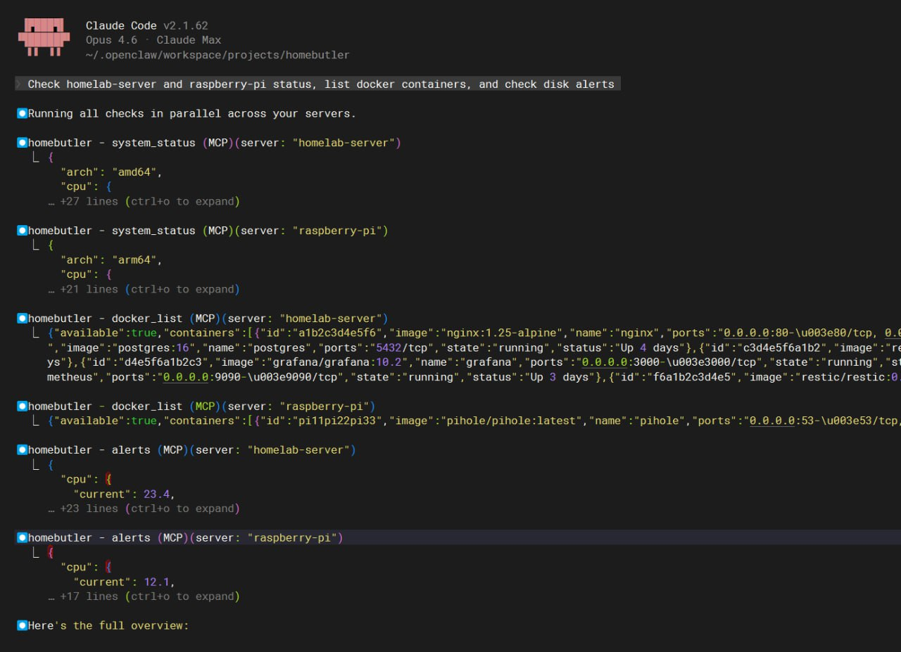
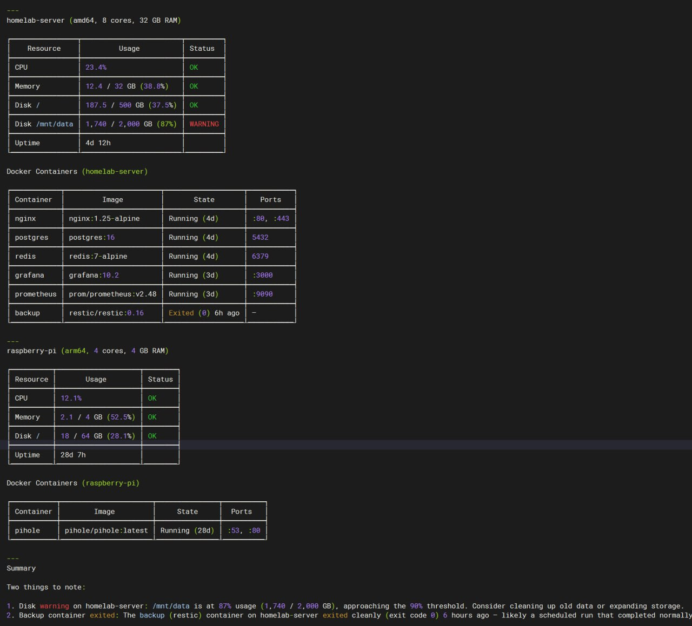

# MCP Server

homebutler includes a built-in [MCP (Model Context Protocol)](https://modelcontextprotocol.io/) server, so any AI tool can manage your homelab — with natural language.

> *"Check all my servers and list docker containers"*
>
> One prompt. Multiple servers. Full visibility.

<p align="center">
  
</p>

<p align="center">
  <em>Claude Code calls homebutler tools in parallel across servers</em>
</p>

<p align="center">
  
</p>

<p align="center">
  <em>Formatted results: server status, Docker containers, and disk alerts — from one prompt</em>
</p>

## Try Without Real Servers

```bash
# Demo mode — realistic data, no real system calls
homebutler mcp --demo
```

Add `"args": ["mcp", "--demo"]` to your MCP config to try it instantly.

## Supported Clients

- **Claude Code** — Anthropic's CLI for Claude
- **Claude Desktop** — Anthropic's desktop app
- **ChatGPT Desktop** — OpenAI's desktop app
- **Cursor** — AI code editor
- **Windsurf** — AI code editor
- **Any MCP-compatible client**

## Setup

Add to your MCP client config:

**Quick setup (no install needed):**
```json
{
  "mcpServers": {
    "homebutler": {
      "command": "npx",
      "args": ["-y", "homebutler@latest"]
    }
  }
}
```

Add this to `.mcp.json` (Claude Code / Cursor) or your MCP client config (Claude Desktop / ChatGPT Desktop).

**If homebutler is already installed:**
```json
{
  "mcpServers": {
    "homebutler": {
      "command": "homebutler",
      "args": ["mcp"]
    }
  }
}
```

Restart your AI client — homebutler tools will appear automatically.

## Available Tools

| Tool                     | Description                                                                                                            |
|--------------------------|------------------------------------------------------------------------------------------------------------------------|
| `system_status`          | CPU, memory, disk, uptime                                                                                              |
| `report`                 | Butler-style health report with snapshot comparison and suggested actions                                              |
| `doctor`                 | Read-only diagnosis of resource pressure, stopped containers, public ports, backup hygiene, notification readiness, whether a watch service is installed, config file permissions, containers mounting the Docker socket, Proxmox endpoints accepting any certificate, incident history nearing its limit, and configured Proxmox endpoint reachability |
| `watch_check`            | One-shot restart check on watched targets; reports systemd and pm2 targets as skipped rather than healthy              |
| `watch_history`          | Recorded restart incidents, newest first. Captured logs are excluded unless `include_logs` is set                      |
| `watch_list`             | Targets being watched, with their kind and what the last check recorded                                                |
| `inventory_scan`         | Server inventory/topology: system, containers, app ports, system ports                                                 |
| `inventory_export`       | Export inventory as Mermaid (local) or JSON                                                                            |
| `docker_list`            | List containers                                                                                                        |
| `docker_restart`         | Restart a container                                                                                                    |
| `docker_stop`            | Stop a container                                                                                                       |
| `docker_logs`            | Container log output                                                                                                   |
| `docker_stats`           | Running container resource usage                                                                                       |
| `docker_top`             | Processes inside a container, read from the host — no exec, no TTY                                                     |
| `docker_inspect`         | Image, state, restart policy, ports, mounts, networks, health. Env values are never included                           |
| `wake`                   | Wake-on-LAN magic packet                                                                                               |
| `open_ports`             | Open ports with process info                                                                                           |
| `network_scan`           | Discover LAN devices                                                                                                   |
| `alerts`                 | Resource threshold alerts                                                                                              |
| `backup_create`          | Create Docker compose backup archive                                                                                   |
| `backup_list`            | List backup archives                                                                                                   |
| `backup_drill`           | Boot a backup in isolation and verify app health                                                                       |
| `backup_restore`         | Restore volumes from a backup archive                                                                                  |
| `install_list`           | List installable self-hosted apps                                                                                      |
| `install_app`            | Install an app via generated docker-compose.yml                                                                        |
| `install_status`         | Check installed app status                                                                                             |
| `install_uninstall`      | Stop an app while preserving data                                                                                      |
| `install_purge`          | Stop an app and delete all data                                                                                        |
| `processes`              | Top processes by CPU or memory, with zombies broken out separately                                                     |
| `config_validate`        | Check the config file this server is running on                                                                        |
| `proxmox_status`         | Proxmox VE version, cluster status, and resources                                                                      |
| `proxmox_guests`         | Unified QEMU/LXC guest list; optional `node`, `status`, `type` filters                                                 |
| `proxmox_node`           | Node detail; requires `node`                                                                                           |
| `proxmox_tasks`          | Recent tasks for a node; requires `node`                                                                               |
| `proxmox_guest_start`    | Start a guest; requires `node`, `type`, `vmid`, and literal `confirm: true`                                            |
| `proxmox_guest_reboot`   | Reboot a guest; requires `node`, `type`, `vmid`, and literal `confirm: true`                                           |
| `proxmox_guest_shutdown` | Gracefully shut down a guest; requires `node`, `type`, `vmid`, and literal `confirm: true`                             |
| `proxmox_task_status`    | Status of one task; requires `node` and the opaque `upid`                                                              |
| `proxmox_script_list`    | List the curated Proxmox VE Community Scripts catalog                                                                  |
| `proxmox_script_command` | Render the pinned install command for one Community Script; never fetches or runs it                                   |

Most read/check tools support an optional `server` parameter — manage every server from a single prompt. Destructive tools such as `backup_restore`, `install_purge`, and container stop/restart should only be called after the user clearly confirms intent.

`config_validate` is the exception: it has no `server` parameter. It answers whether the config this MCP server is running on is valid, which is a question about this machine, and pointing it at a remote would answer about a different file.

### What is deliberately not exposed

Omissions worth stating, so they read as decisions rather than gaps.

**`trust`** accepts SSH host keys on first use. An agent auto-accepting TOFU is exactly the boundary this project promises not to cross, so there is no tool for it and there will not be one.

**`upgrade`** replaces the running binary. **`serve`**, **`init`**, **`watch start`** and **`watch tui`** are daemons or interactive; neither shape fits a stdio request and response.

**`deploy`** is deferred past 1.0. Remote install is the highest-risk surface here and should not be frozen into the first stable tool set.

## How It Works

```
You: "Check my servers and find any disk warnings"
AI → calls report or system_status + alerts on each server (in parallel)
homebutler → reads CPU/RAM/disk on local + remote servers via SSH
AI: "homelab-server /mnt/data is at 87% — consider cleaning up. Everything else healthy."
```

No network ports opened. MCP uses stdio (stdin/stdout) — only the parent AI process can communicate with homebutler.

### Protocol versions

homebutler implements the MCP revisions `2026-07-28`, `2025-11-25`,
`2025-06-18`, `2025-03-26` and `2024-11-05`. Modern clients send the protocol
version and client capabilities in each request's `_meta`; they can start with
`server/discover` without an `initialize` handshake. Legacy clients continue to
use `initialize` unchanged. An `initialize` request that carries modern `_meta`
is rejected because the two opening modes contradict each other.

For a tools-only stdio server these revisions describe the same tool surface.
Modern `tools/list` responses include `resultType`, a five-minute `ttlMs` hint,
`cacheScope: "public"`, and a deterministic tool order. What the later
revisions added is either out of scope here — resources, prompts, sampling,
roots, elicitation, tasks, and everything about Streamable HTTP — or already
how homebutler behaves.

### Two lists, two questions

`server/discover` advertises every revision this server can be reached by, both
eras, because a dual-era server genuinely answers an `initialize` handshake as
well as modern per-request metadata.

`UnsupportedProtocolVersionError` (`-32022`) lists only the revisions that may
appear in a request's `_meta`. A legacy revision arriving there is a
contradiction rather than a version the server declined, and offering it back
would tell a client to retry with the version it was just refused — the spec
asks the client to pick from that list and try again.

## Agent Skill

homebutler ships with an [Agent Skill](https://agentskills.io) that works across AI tools:

**Claude Code / Cursor / Gemini CLI** — copy the skill to your personal skills directory:

```bash
mkdir -p ~/.claude/skills/homeserver
cp skills/homeserver/SKILL.md ~/.claude/skills/homeserver/
```

Then ask Claude Code: *"Check my server status"* — or invoke directly with `/homeserver`.

**OpenClaw** — install from [ClawHub](https://clawhub.ai/Higangssh/homeserver):

```bash
clawhub install homeserver
```

Manage your homelab from Telegram, Discord, or any chat platform — in any language.
